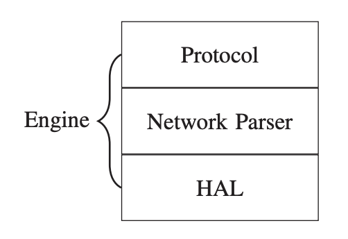








Master Student in Fudan University. Focus on Speech Synthesis, Large Language Models and Multimodal Learning.

# 🔥 News
- Nothing new here.

# 📝 Publications 

<!-- 论文 2 -->

ICASSP 2025

[RecNet: Optimization for Dense Object Detection in Retail Scenarios Based on View Rectification](https://ieeexplore.ieee.org/document/10887773)  
Junhao Xiao, Yi Chen, Xiao Feng, Ruoyu Wang, **Zhiyu Wu**. *ICASSP'25*, CCF-B.

<!-- 论文 1 -->

CSCWD 2024

[Qiao: DIY your routing protocol in Internet-of-Things](https://ieeexplore.ieee.org/abstract/document/10580573)  
**Z Wu**, Y Wang. *CSCWD'24*, CCF-C.
- We build a software router upon Linux via Golang for protocol modification and routing.

# 📖 Educations
- *2024.9 - 2027.06* , Fudan University, Shanghai, China.
- *2020.10 - 2024.06*, Zhejiang A&F University, Zhejiang, China. 

# 💻 Internships

 *2025.6 - now*, Speech LLM Intern, Department of Large Language Model, [Qifu Technology, Inc](https://www.qifu.tech), Shanghai, China.

 *2024.12 - 2025.06*, Speech Synthesis Intern, Department of Artificial Intelligence, [BiliBili, Inc](https://www.bilibili.com), Shanghai, China.